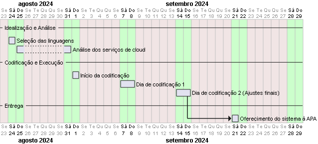

1 - DIAGNÓSTICO E TEORIZAÇÃO

O serviço de voluntariado tem sido realizado comumente via grupos de whatsapp desde seu aparecimento. É um primeiro passo, ainda tímido rumo a informatização do sistema de voluntariado nacional que caminha de maneira arcaica e métodos praticamente artesanais. É notório a necessidade de informatização deste procedimento, bem como seria de bom grado a unificação de todos os serviços de voluntariado existentes no municipio em um lugar de fácil acesso à quem deseja realizar serviços comunitários.

1.1 - Identificação das partes envolvidas e parceiros

Embora seja possível a entrada de qualquer associação de serviço voluntária. Inicialmente visa-se a APA (Associação de Proteção Animal de Uberlândia)

1.2 - Situação-problema identificada

O sistema de voluntariado é absolutamente imprevisível, podendo ou não obter voluntariado disponível tanto quanto obte-los em excesso. Os voluntários por sua vez conhecem apenas as associações que estão acostumados a se voluntariarem, sem possibilidade de se voluntariarem de forma mais abrangente em vários locais possíveis.

1.3 - Demanda sociocomunitária e motivação acadêmica

A integração comunitária será enriquecida com uma facilitação do acesso à um serviço que aproxime a comunidade do acesso à serviços de voluntariados. Utilizando os serviços de cloud e desenvolvendo uma aplicação que auxilie a comunidade a se integrar é uma boa forma de utilização dos meios eletrônicos e serviços cloud.

1.4 - Objetivos a serem alcançados em relação à situação-problema identificada

Uma maior rotatividade de voluntariados, bem como promoção do aumento de voluntários. Aproximação das entidades filantrópicas do maior número de voluntários possível e exposição das entidades à comunidade de forma mais organizada e centralizada. 

2 - PLANEJAMENTO PARA DESENVOLVIMENTO DA ATIVIDADE

Primeiramente será buscada uma linguagem ideal para o desenvolvimento do aplicativo web mais utilizadas no mercado sendo no backend C# (com ASP.NET), NodeJS (com NestJS) ou Java (com Spring Web), e no frontned Angular ou React, também sendo possível a elaboração de um aplicativo para Android seja pelo Android View System, Flutter, React Native ou Ionic a depender da consolidação do projeto e sua viabilidade prática.

2.1 - Plano de trabalho com cronograma das atividades

Planejamento conforme mapa de Gantt abaixo.

2.2 - Envolvimento do público participante

O público é composto por entidades e voluntários, ambos se cadastrando cada um com seu respectivo interesse, sendo as entidades cadastrarem e gerenciarem suas vagas, bem como os voluntários de encontrarem as vagas cadastradas para servir.

2.3 - Avaliação dos resultados alcançados

Pendente.

3 - ENCERRAMENTO DA ATIVIDADE
3.1 - Relato da experiência individual no desenvolvimento da atividade
3.2 - Evidências das atividades realizadas

Observação: este site inclui um sistema de acessibilidade. Pressione Control-F11 para ajustar o site aos deficientes visuais que usam um leitor de tela; Pressione Control-F10 para abrir um menu de acessibilidade.
Acessibilidade
Pressione Enter para acessar acessibilidade para cegosque usam leitores de tela
Pressione Enter para Navegação pelo Teclado
Pressione Enter para acessar o menu de acessibilidade
Trabalho de Extensão
Atividade de extensão obrigatória, que deve ser completada no semestre e possui valor de 6 (seis) pontos.
​
Título do Projeto...

1 - DIAGNÓSTICO E TEORIZAÇÃO

1.1 - Identificação das partes envolvidas e parceiros
Descrever as partes envolvidas no projeto, quem é o público da comunidade local envolvido na atividade (incluindo: perfil socioeconômico, escolaridade, gênero, faixa etária, dados sociais e quantidade estimada de participantes, dentre outras informações importantes). Nesta etapa, é importante demonstrar quem são as pessoas envolvidas na sua atividade de extensão. Lembre-se: você escolhe qual público deseja escolher para realizar esta atividade.

Exemplo:
Membros da comunidade (mínimo 1, máximo indefinido) como pequenos empreendedores, profissionais liberais, membros de ONGs, organizações locais, entre outros.
(Observe que seu texto deve ser compatível com o previsto na Seção Descrição do Público Envolvido do Plano de Aprendizagem dessa Disciplina.)

1.2 - Situação-problema identificada
Apresentar os problemas identificados na comunidade local que motiva a elaboração desta atividade de extensão. Nesta etapa, deve-se demonstrar de maneira clara a situação-problema vivenciada no local escolhido para realizar a sua atividade. Mas o que é uma situação-problema? É a principal “dor” ou queixa reconhecida na escuta desta comunidade. Você deverá realizar encontros/conversas/trocas/ com os indivíduos ou grupos da comunidade local para identificar quais são estas dores.

Exemplo:
Nos encontros e conversas com as pessoas envolvidas foi identificado que os computadores utilizados têm baixo poder de processamento e baixa capacidade de armazenamento e a maioria dos softwares executados estão instalados localmente.

1.3 - Demanda sociocomunitária e motivação acadêmica
Citar a situação-problema da comunidade e esclarecer de que maneira isto impacta a vida social, educacional, cultural e/ou econômica das pessoas envolvidas. Nesta etapa, você descreverá como os conteúdos estudados na disciplina permitem que ajude esta comunidade a solucionar ou reduzir as queixas identificadas. Aqui, você descobrirá a importância de estudar e como isto pode melhorar a vida das pessoas à sua volta.

Exemplo:
Aplicar os conceitos teóricos e práticos desta disciplina para utilizar recursos na nuvem tanto para execução quanto para armazenamento ajudará microempreendedores locais a terem mais recursos computacionais e assim serem bem-sucedidos em seus negócios.
(Observe que a Demanda sociocomunitária deve ser compatível com as Seções Objetivos, e Objetivos Sociocomunitários do Plano de Aprendizagem dessa Disciplina.)

1.4 - Objetivos a serem alcançados em relação à situação-problema identificada
Descrever entre um e três objetivos, no máximo, que devem ser alcançados com o desenvolvimento da atividade de extensão. Os resultados esperados de uma atividade de extensão devem ser claros, específicos, possíveis de serem medidos e com prazo de realização para que a comunidade participe e avalie o alcance dos objetivos. Lembre-se: os objetivos devem ser definidos com verbos de ação (verbo no infinito), de maneira clara, em forma de tópicos (quando for mais de um), correspondentes aos resultados que a atividade de extensão realizada por você pretende alcançar.

Exemplo:
Liberar espaço de armazenamento do computador utilizado pela parte interessada utilizando recursos da nuvem
(Observe que este(s) objetivo(s) a ser(em) deve(m) ser compatível(is) com as Seções Objetivos, e Objetivos Sociocomunitários do Plano de Aprendizagem dessa Disciplina.)

2 - PLANEJAMENTO PARA DESENVOLVIMENTO DA ATIVIDADE

2.1 - Plano de trabalho com cronograma das atividades
Descrever o plano de trabalho (o que fazer; quando fazer; como fazer; para quem fazer, onde fazer), incluindo informações sobre cada uma das ações a serem executadas para alcançar os objetivos da atividade de extensão.
O que fazer: indique a ação que precisa ser realizada;
Quando fazer: quando será realizada a ação, prazo de realização;
Como fazer: como você realizará esta ação, incluindo os recursos mínimos necessários;
Para quem fazer: quem irá participar desta ação;
Onde fazer: local em que realizará a ação.

Exemplo:
Objetivo: Liberar espaço de armazenamento do computador utilizado pela parte interessada utilizando recursos da nuvem
Ação 1: analisar o computador utilizado e quais as demandas de espaço necessárias. Prazo: até o dia X;
Ação 2: buscar alternativas de armazenamento gratuito na nuvem. Prazo: até o dia X;
Ação 3: ler os conteúdos digitais da SAVA, os livros indicados nas referências na Biblioteca Virtual, identificar quais deles você utilizará na ação. Prazo: até o dia X;

(Outras ações que considere pertinente)
Ação 4
Ação 5

2.2 - Envolvimento do público participante
Apresentar como a comunidade atuará no planejamento, desenvolvimento e avaliação da atividade de extensão. O diálogo constante com esses grupos ou indivíduos é fundamental para que ocorra a interação entre a instituição de ensino e a comunidade. É preciso deixar claro como essa troca de informações, dados e conhecimentos ocorre entre o estudante e os participantes da sua atividade. Lembre-se: é imprescindível produzir registros (ex: fotos, capturas de tela, mensagens, formulários etc.) das reuniões, discussões, interações para evidenciar os encontros, garantindo a demonstração do envolvimento da comunidade na sua atividade). Todos estes registros devem entrar na Seção “Evidências das Atividades Realizadas”.

Exemplo:
Conversa com os microempreendedores para identificar a situação-problema que eles convivem no dia a dia de seus negócios;
Organização do material da ação;
Reunião de treinamento para ensinar os envolvidos a usar os novos softwares instalados;
Reunião de avaliação para obter a opinião dos envolvidos das soluções em nuvem sobre o atingimento do objetivo.

2.3 - Avaliação dos resultados alcançados
Descrever os instrumentos que serão usados para avaliar como a atividade de extensão ajudou a comunidade na redução de suas queixas ou problemas identificados. Além disto, é importante também descrever o que você espera em termos de resultado com a realização da sua atividade.

Exemplo:
Nas conversas e análise do equipamento da parte interessada, identificou-se que alguns microempreendedores não tinham conhecimento sobre como otimizar seus recursos utilizando processamento e armazenamento na nuvem. A solução proposta foi realizar uma análise e ação nesses computadores, visando melhorar o seu desempenho.
Para avaliar o resultado, usou-se os seguintes indicadores:
Quantidade do espaço de armazenamento disponível no computador no início dos trabalhos;
Quantidade do espaço de armazenamento liberado após a ação realizada.

1. - ENCERRAMENTO DA ATIVIDADE

3.1 - Relato da experiência individual no desenvolvimento da atividade
Seu relato precisará conter:
1. CONTEXTUALIZAÇÃO – Explicar a experiência de extensão vivenciada, contextualizando a sua participação, explicando ainda como teoria e os conteúdos dessa disciplina foram aplicados na prática, a partir desta troca com a comunidade local.
2. METODOLOGIA – Descrever que métodos foram usados para realizar sua atividade de extensão, isto é, dinâmicas de grupo, entrevistas, questionários, ou algum outro método de levantamento de dados, e explicar o que foi efetivamente executado, incluindo os detalhes de implementação.
3. RESULTADOS E DISCUSSÃO - Detalhar os resultados obtidos na atividade realizada, como, por exemplo, os impactos que ela gerou na comunidade envolvida, as facilidades e dificuldades que você enfrentou durante esta experiência e quais descobertas e aprendizagens teve neste processo.

Exemplo:
A relação entre a experiência vivida e o conteúdo estudado foi fundamental para meu desenvolvimento pessoal e profissional ao relacionar a prática com o conteúdo teórico, tive uma compreensão mais profunda e consegui compreender como aplicar na vida real. Tivemos oportunidade de contribuir positivamente para a sociedade ao identificar as necessidades deste público vulnerável.
Realizei duas conversas e duas ações com os microempreendedores locais. Na ocasião, consegui perceber que, eles possuem equipamentos antigos e precisam liberar espaço de armazenamento e melhorar o desempenho na execução dos sistemas.
Realizei as duas ações diretamente no computador da parte interessada, após análise das soluções mais indicadas, de acordo com o conteúdo da disciplina aqui estudada.
Quando terminei a ação, percebi que esta experiência despertou em mim e nos participantes senso de responsabilidade social e coletiva, dedicando parte do meu tempo de estudo, e, principalmente, que aquilo que aprendi pode fazer a diferença na vida das pessoas.

3.2 - Evidências das atividades realizadas
Incluir evidências do processo de desenvolvimento da atividade de extensão (ex: fotografias, capturas de tela ou por vídeos, carta de autorização assinada pelos participantes da comunidade local, carta de apresentação etc.). Este conjunto de evidências comprovará a realização das atividades, como também poderão ser usadas para exposição da atividade em mostras acadêmico-científicas e seminários de extensão a serem realizados pela instituição de ensino.

Exemplo:
No preenchimento deste item você deve redigir um texto que:
descreve em detalhes cada evidência que você está fornecendo no upload de arquivos. Forneça os nomes dos arquivos enviados como anexo. Ex. Imagem1, diagrama1, etc.
Contextualize cada evidência: descreva o contexto para cada evidência anexada, ou seja, o que estava acontecendo no momento e por que a evidência é relevante para a atividade extensionista, além de indicar o que você deseja mostrar com essa evidência. Informe data, local, e qualquer informação específica que a identifique.
Após o preenchimento do texto, faça upload dos arquivos das evidências, por exemplo:
Foto ou vídeo das Reuniões;
E-mails trocados entre as partes envolvidas;
Link para git contendo o código fonte do software desenvolvido;
outros.

Termo de Responsabilidade
Atesto, para os devidos fins, que a Atividade de Extensão foi realizada com a participação efetiva da comunidade no local descrito e conforme relato apresentado no Laboratório de Extensão da Sala de Aula Virtual, gerando texto de autoria própria e sendo entregue dentro do prazo estabelecido no calendário acadêmico vigente.
​
Nome completo
​
Local de realização da atividade de extensão
